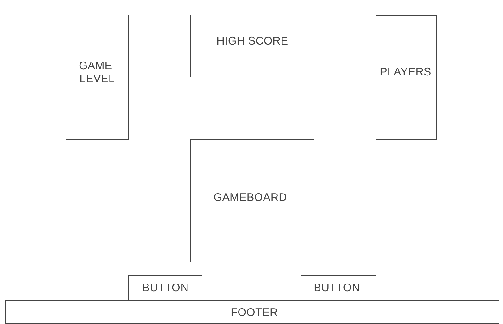

# Simon Says Game

This classic game of memory will test your skills in a progressively faster sequence of lights and sounds. Enjoy trying to beat Simon!

[Simon](https://simon-game-nmorgan.netlify.com/)

[Trello](https://trello.com/b/Uao4ghMs/simon)

## How to Play:
___
1. Click the level you want to play on the left of the screen
2. To Begin, press the Start button and enter in your name
3. If there is no Player 2, press cancel
4. Click the light after it has blinked
5. Continue clicking the lights in sequence as they appear
6. Try to beat the high score

## Wireframe:
___

### Game Design

## Technologies:
___

* Languages - Javascript and CSS
* Design - Google Fonts
* Visual Studio Code

## Features and Future Improvements:
___

#### Current Features

* Difficulty Levels
* Single Player Mode
* High Score
* Scoreboard
* Reset Game Button

#### Future Improvements:

* In Version 2 of this game I would like to modify the layout of the game to more resemble the look of the handheld game. I would design Simon into a circle with seperate color quarters.

* I would also like to have the screen fade away once the high score has been reached and the player's name and high score be displayed for a certain period of time.