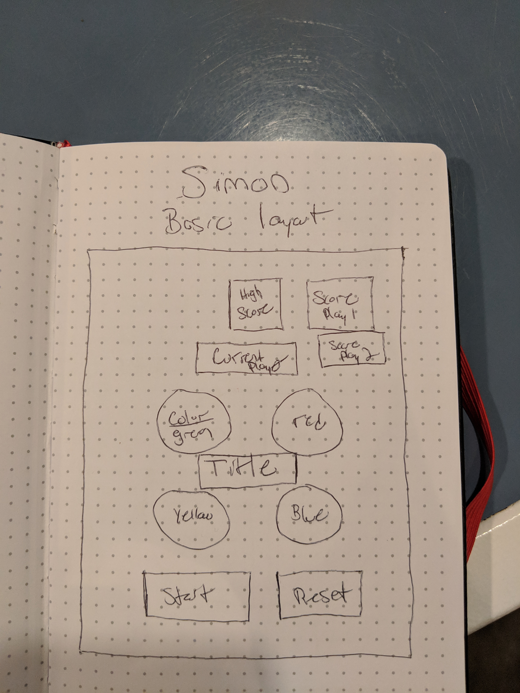
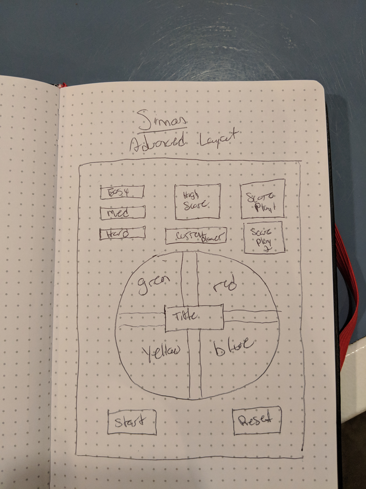

# Simon Says Game
This classic game of memory will test your skills in a progressively faster sequence of lights and sounds. Enjoy trying to beat Simon!

[Simon](https://simon-game-nmorgan.netlify.com/)

[Trello](https://trello.com/b/Uao4ghMs/simon)

## How to Play
1. Click the level you want to play on the left of the screen
2. To Begin, press the Start button and enter in your name
3. If there is no Player 2, press cancel
4. Click the light after it has blinked
5. Continue clicking the lights in sequence as they appear
6. Try to beat the high score

## Wireframe

### Basic Layout Design

### Advanced Layout Design

## Technologies

### The following technologies were used in the production of this Simon game

* Javascript
* CSS

## Features and Future Improvements

Currently, the user is able to select 